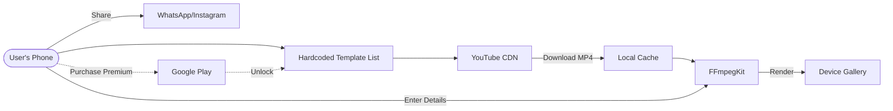
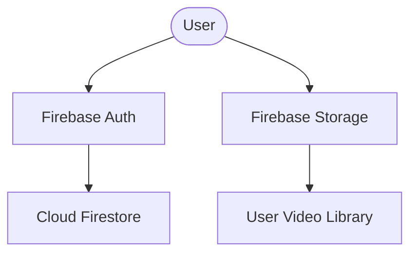
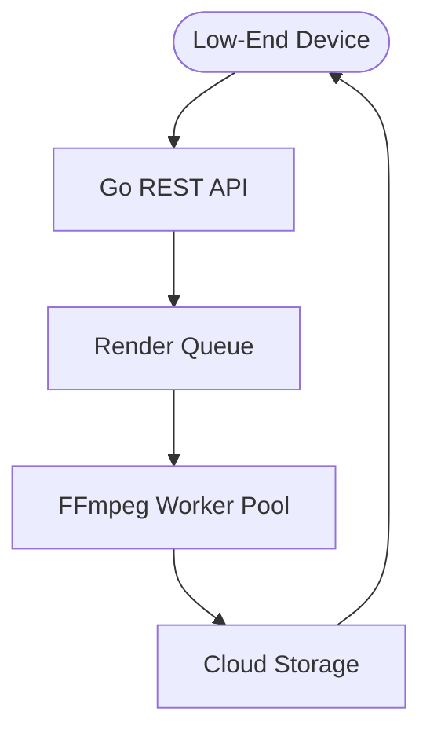

# Vivaah Master Architecture & Technical Specification

## 1. Executive Summary
Vivaah is a **client-first** wedding invitation video platform designed for rapid market validation. Version 1.0 focuses exclusively on on-device video rendering with zero backend dependencies, using YouTube CDN for template delivery and Google Play Billing for monetization.

**Future versions** will introduce cloud features (user accounts, server rendering) based on user demand and device performance metrics.

---

## 2. Version 1.0 Architecture (MVP)

### 2.1 Technology Stack (v1.0)
| Layer | Technology | Role |
| :--- | :--- | :--- |
| **Frontend** | Flutter (Android) | Cross-platform mobile experience (Material 3 / Royal Theme) |
| **Backend** | None | Zero server dependencies for v1.0 |
| **Database** | Local SQLite | Template metadata cache only |
| **Content Delivery** | YouTube CDN | Global, infinite bandwidth template hosting |
| **Render Engine** | FFmpegKit | On-device video composition (Text-on-Video, Overlays) |
| **Payment** | Google Play Billing | In-app purchases for premium templates |
| **Analytics** | None (v1.0) | Optional local crash logging only |

### 2.2 v1.0 Data Flow

### 2.3 Key Design Decisions (v1.0)

#### ✅ What's Included
1. **Hardcoded Template Catalog**: 5-10 templates with YouTube IDs embedded in JSON
2. **Offline-First**: Videos can be generated without internet (after template download)
3. **No Login Required**: Zero friction user experience
4. **Local Storage**: All user creations saved to device gallery
5. **Google Play Billing**: One-time purchase for "Premium Templates Pack"

#### ❌ What's Deferred (v2.0+)
1. Firebase Authentication
2. Cloud storage for user videos
3. Server-side rendering
4. Cross-device sync
5. Analytics and crash reporting

---

## 3. Current Implementation Status

### ✅ Completed (v1.0 Ready)
- [x] **YouTube CDN Integration**: Fetching direct video streams via `youtube_explode_dart`
- [x] **Local Render Engine**: `ClientRenderService` with FFmpeg wrappers
- [x] **Cinematic UI**: Royal theme, progress indicators, success states
- [x] **On-Device Sharing**: Play Now and social sharing (WhatsApp/Instagram)

### 🔄 In Progress (v1.0 MVP Blockers)
- [ ] **Strip Firebase**: Remove all Firebase dependencies from `pubspec.yaml` and `main_common.dart`
- [ ] **Remove Auth/Profile**: Delete login, profile, and session management screens
- [ ] **Google Play Billing**: Integrate `in_app_purchase` package
- [ ] **Hardcode Templates**: Create local JSON config for YouTube template mappings
- [ ] **Navigation Simplification**: Direct users from splash → templates → creator

---

## 4. Future Architecture (v2.0+)

### Phase 4: User Accounts & Cloud Sync (v2.0)
**Deploy only if v1.0 gains >1000 active users**

**Features**:
- Google/Email sign-in
- Cloud storage for created videos
- Cross-device history sync
- Analytics (Firebase Analytics, Crashlytics)

### Phase 5: Server-Side Rendering (v3.0)
**Deploy if client rendering fails on >20% of devices**

**Features**:
- Go server with FFmpeg workers
- Render job queue (concurrency control)
- Premium HD/4K rendering tier
- Automatic fallback for low-end devices

---

## 5. Monetization Strategy

### v1.0: In-App Purchase
- **Free Tier**: 3 basic templates, unlimited renders
- **Premium Pack**: $4.99 one-time purchase for 10+ premium templates
- **No Subscription**: Avoid recurring costs to maximize conversions

### v2.0+: Subscription Model
- **Basic**: $2.99/month (cloud sync, basic templates)
- **Premium**: $7.99/month (HD server rendering, all templates)

---

## 6. Cost Analysis

### v1.0 (Client-Only)
| Component | Cost |
| :--- | :--- |
| Bandwidth | $0 (YouTube CDN) |
| Rendering | $0 (on-device) |
| Server | $0 (no backend) |
| **Total per user** | **$0.00** |

### v2.0+ (Cloud Features)
| Component | Cost |
| :--- | :--- |
| Firebase (Auth, Firestore, Storage) | ~$0.10/user/month |
| Server (VPS) | $20/month (fixed) |
| **Estimated marginal cost** | **$0.10/user** |

---

## 7. Risk Mitigation

| Risk | Impact | Mitigation |
| :--- | :--- | :--- |
| FFmpeg fails on low-end devices | High | Phase 2: Add server fallback |
| YouTube blocks video downloads | Critical | Maintain fallback CDN (S3/Cloudflare R2) |
| Template copyright claims | High | Use only royalty-free templates or original content |
| Poor conversion rate | Medium | A/B test pricing ($2.99 vs $4.99 vs $7.99) |
