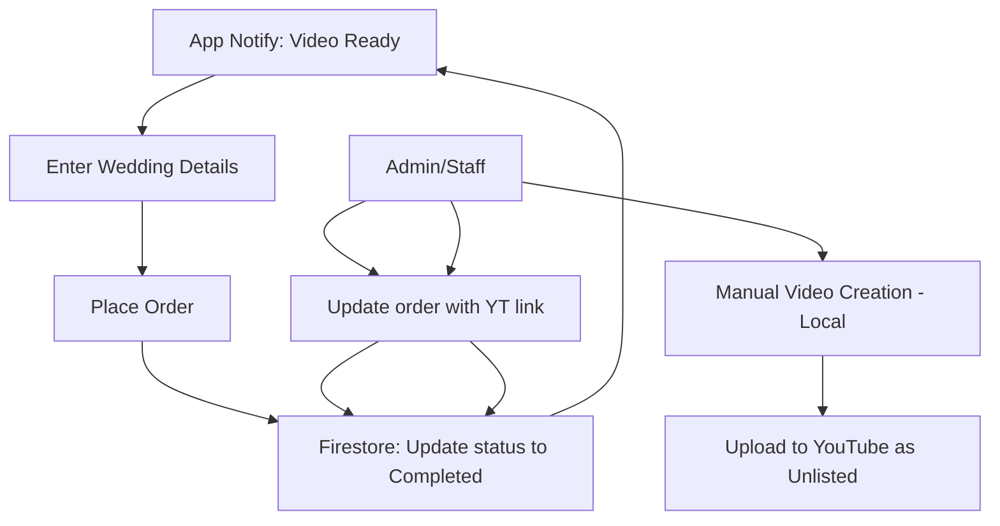

# Vivaah Master Architecture & Technical Specification

## 1. Executive Summary
Vivaah is a wedding invitation video platform. Version 1.0 includes **User Accounts (Google Sign-In only)** and **Manual Fulfillment** where admins create videos manually and deliver them via unlisted YouTube links.

The architecture follows a **Hybrid Backend** approach using Go (VPS) and Firebase to minimize production costs while providing a secure, account-based experience.

---

## 2. Version 1.0 Architecture (Production)

### 2.1 Technology Stack
| Layer | Technology | Role |
| :--- | :--- | :--- |
| **Frontend** | Flutter (Android) | Cross-platform mobile experience |
| **Database** | Firebase Firestore | Real-time order sync and metadata |
| **Backend** | Go (VPS) | Admin Panel and high-volume API requests |
| **Auth** | Firebase Auth | Secure user management (Free Tier) |
| **Delivery** | YouTube | **Free** video hosting and streaming |
| **Video Creation** | Manual | Created by staff via professional software |

### 2.2 Production Data Flow (Manual Fulfillment)

---

## 3. Hybrid Backend Cost Optimization (Zero-Variable-Cost)

To maintain a $0 variable cost profile, we use the **Go VPS** for all data-heavy operations.

1. **YouTube ($0)**: Primary video hosting.
2. **Go VPS Database (Primary)**: The VPS hosts a local SQL database (PostgreSQL/SQLite) that stores all order details, logs, and billing history.
3. **Firebase Firestore (Sync-Only)**: Used ONLY to relay order status changes (e.g., "Pending" -> "Completed") to the app in real-time. This keeps us safely within the free tier.
4. **OpenClaw (Moltbot)**: Handles background tasks on the VPS for free.
5. **Firebase Auth**: Used for Google Sign-In only (Free).

---

## 4. Current Implementation Status

### ✅ Completed
- [x] YouTube template gallery and download service
- [x] Invitation creator wizard (style → details → preview)
- [x] Order repository for tracking
- [x] Admin dashboard foundation
- [x] Royal theme branding

### 🔄 In Progress
- [ ] Refinement of manual fulfillment UI
- [ ] Go + Firebase production integration
- [ ] Google Play Billing integration

---

## 5. Futuristic Architecture (Phase 5+)

### On-Device Rendering (FFmpeg)
**Goal**: Fully automated instant rendering on the user's device.
- Re-integrate **FFmpegKit** for local composition.
- Automatic text-on-video overlays.
- Reduced dependency on admin fulfillment.

---

## 6. Risk Mitigation
- **YouTube Controls**: If unlisted links are restricted, we will use a self-hosted CDN on the VPS.
- **Order Volume**: If manual fulfillment slows down, we will implement the auto-rendering (Phase 5) earlier.

