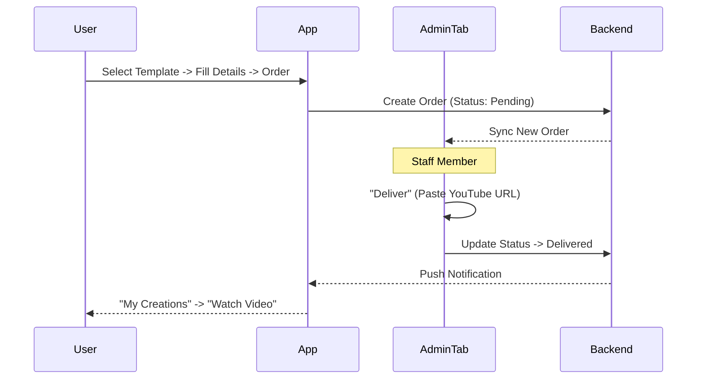

# Architecture & Navigation Structure

## 1. High-Level Architecture
Vivaah uses a **Clean Architecture** approach with **Bloc** for state management.

### Layer Separation
- **Presentation**: UI Widgets & BLoCs (State management only, no logic).
- **Domain**: Entities, Use Cases, Repository Interfaces (Pure Dart, no dependencies).
- **Data**: Repository Implementations, Data Sources, DTOs (API/DB calls).

## 2. Navigation Architecture (Hotstar-Inspired)
The app uses a strict 5-tab structure managed by `IndexedStack`.

### Tabs
| Index | Tab | Component | Responsibility |
| :--- | :--- | :--- | :--- |
| **0** | **Home** | `HomeDashboard` | Featured carousel, categories rails, cinematic browsing. |
| **1** | **Search** | `SearchScreen` | Text search ("Royal", "Sangeet") + category chips. |
| **2** | **Shorts** | `ShortsScreen` | Vertical full-screen video feed (YouTube Shorts style). |
| **3** | **Creations** | `CreationsGalleryScreen` | User's order history (In Progress, Completed) & drafts. |
| **4** | **Account** | `SettingsScreen` | User profile, policies, sign out. |
| **5** | **Admin** | `AdminScreen` | **Conditional**: Visible only to `AppConfig.adminUids`. Data entry & fulfillment. |

## 3. Data Flow (Order Fulfillment)

## 4. Technical Constraints (v1.0)
- **Null Safety**: Strict throughout.
- **Orientation**: Portrait only.
- **Auth**: Google Sign-In only (Firebase).
- **Backend Strategy**: **Hybrid ACTIVE** (Firebase for Auth/Sync/Real-time, Go VPS for API/Database).
- **Real-time Config**: Firestore-backed `RemoteConfigService`.
- **Offline Favorites**: Firestore-backed `ShortsRepository`.
