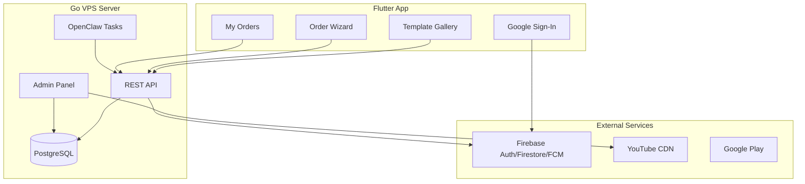

# Vivaah v1.0 - Complete Implementation Plan

## Executive Summary
This document outlines the **complete** implementation plan for Vivaah v1.0 - a wedding invitation video platform with manual fulfillment, per-video pricing, and zero variable costs.

**Core Strategy**: Build a production-ready app with Google Sign-In, order tracking, push notifications, and an admin panel—all while staying within Firebase's free tier by using VPS for heavy lifting.

---

## 1. v1.0 Feature Set

### 1.1 User-Facing Features
- ✅ **Google Sign-In** (Firebase Auth)
- ✅ **Template Gallery** with dynamic pricing and tags
- ✅ **Order Placement** workflow (Style → Details → Order)
- ✅ **Order History** - Personal gallery of all videos
- ✅ **Push Notifications** - Real-time alerts when video is ready
- ✅ **Video Playback** - Watch completed videos in-app
- ✅ **Share** - Direct share to WhatsApp/Instagram
- ✅ **Google Play Billing** - Per-video payment

### 1.2 Admin Features
- ✅ **Login with Firebase Auth** (Staff accounts)
- ✅ **Order Dashboard** - View pending/in-progress orders
- ✅ **Template Management** - Add/edit templates with pricing and tags
- ✅ **Order Fulfillment** - Upload YouTube links and mark completed
- ✅ **Analytics** - Order count, revenue tracking

---

## 2. Technology Stack (v1.0)

| Component | Technology | Purpose |
|-----------|------------|---------|
| **Mobile App** | Flutter + BLoC | Cross-platform (Android primary) |
| **Backend API** | Go (Gin/Echo) on VPS | Fixed-cost server |
| **Database** | PostgreSQL (VPS) | Primary source of truth |
| **Sync Layer** | Firebase Firestore | Real-time status sync only |
| **Authentication** | Firebase Auth | Google Sign-In |
| **Push Notifications** | Firebase Messaging | Order status alerts |
| **Task Automation** | OpenClaw (Moltbot) | Cron jobs on VPS |
| **Video Hosting** | YouTube | Unlisted video delivery |
| **Payments** | Google Play Billing | In-app purchases |

---

## 3. Architecture Overview



---

## 4. Database Schema (PostgreSQL on VPS)

### 4.1 Core Tables

#### `users`
```sql
CREATE TABLE users (
  id UUID PRIMARY KEY,
  firebase_uid VARCHAR(255) UNIQUE NOT NULL,
  email VARCHAR(255),
  display_name VARCHAR(255),
  photo_url TEXT,
  created_at TIMESTAMP DEFAULT CURRENT_TIMESTAMP,
  last_login TIMESTAMP
);
```

#### `templates`
```sql
CREATE TABLE templates (
  id UUID PRIMARY KEY,
  youtube_id VARCHAR(50) NOT NULL,
  title VARCHAR(255) NOT NULL,
  description TEXT,
  thumbnail_url TEXT,
  price_cents INTEGER NOT NULL,
  tags TEXT[], -- ["Premium", "Traditional", "Trending"]
  is_active BOOLEAN DEFAULT TRUE,
  created_at TIMESTAMP DEFAULT CURRENT_TIMESTAMP
);
```

#### `orders`
```sql
CREATE TABLE orders (
  id UUID PRIMARY KEY,
  user_id UUID REFERENCES users(id),
  template_id UUID REFERENCES templates(id),
  
  -- Wedding Details
  bride_name VARCHAR(255) NOT NULL,
  groom_name VARCHAR(255) NOT NULL,
  wedding_date DATE NOT NULL,
  venue VARCHAR(500),
  custom_message TEXT,
  
  -- Order Status
  status VARCHAR(50) DEFAULT 'pending', -- pending, processing, completed, cancelled
  video_url TEXT, -- YouTube URL
  thumbnail_url TEXT,
  
  -- Payment
  payment_status VARCHAR(50) DEFAULT 'pending', -- pending, paid, refunded
  amount_cents INTEGER,
  transaction_id VARCHAR(255),
  
  -- Timestamps
  created_at TIMESTAMP DEFAULT CURRENT_TIMESTAMP,
  delivered_at TIMESTAMP,
  admin_notes TEXT
);
```

---

## 5. API Endpoints (Go Server)

### 5.1 Authentication
- `POST /api/auth/verify` - Verify Firebase token, create/update user

### 5.2 Templates
- `GET /api/templates` - List all active templates
- `GET /api/templates/:id` - Get template details
- `POST /api/admin/templates` - Create template (Admin)
- `PUT /api/admin/templates/:id` - Update template (Admin)

### 5.3 Orders
- `POST /api/orders` - Create new order
- `GET /api/orders` - List user's orders
- `GET /api/orders/:id` - Get order details
- `GET /api/admin/orders` - List all orders (Admin)
- `PUT /api/admin/orders/:id` - Update order status (Admin)

### 5.4 Billing
- `POST /api/billing/verify` - Verify Google Play purchase

---

## 6. Firebase Usage (Free Tier Only)

### 6.1 Firestore Collections

#### `order_status` (Sync Layer)
```javascript
{
  orderId: "uuid",
  status: "pending" | "processing" | "completed",
  videoUrl: "https://youtube.com/...",
  updatedAt: timestamp
}
```

**Usage**: VPS writes 1-2 docs per order. App reads status in real-time.

### 6.2 Cloud Messaging
- **Topic**: `order_updates`
- **Payload**: `{ orderId, status, message }`

**Limit**: 20k messages/day (Free Tier)

---

## 7. Implementation Phases (Prioritized: Firebase -> UI -> VPS)

### Phase 1: Firebase & Shared Foundation (Week 1)
**Goal**: Get the communication and identity layer ready.

- [ ] **Firebase Setup**: Create project, enable Google Sign-In, Firestore, and FCM.
- [ ] **Project Config**: Download configuration files and register App IDs.
- [ ] **Auth Bridge**: Enable Google Sign-In ONLY in the console.
- [ ] **Messaging Core**: Configure FCM certificates and notification channels.
- [ ] **Flutter Foundation**: Finalize Royal theme and basic app bootstrap with Firebase.

### Phase 2: UI & User Experience (Week 2-3)
**Goal**: Build the complete visual and interactive flow.

- [x] **Auth Flow**: Google Sign-In screens and landing logic.
- [x] **Gallery UI**: Template browsing with pricing, tags, and category filters.
- [x] **Order Wizard**: Multi-step flow for capturing wedding details.
- [x] **Creations Gallery**: User history screen with order status tracking.
- [x] **Admin Dashboard (Client-side)**: Staff views for order management (UI only).
- [x] **Mocked Repositories**: Build the app using dummy data while VPS is ready.

### Phase 3: VPS Backend & Data Engine (Week 4-5)
**Goal**: Custom logic and permanent data store.

- [ ] **Infrastructure**: Provision VPS, setup PostgreSQL and OpenClaw.
- [ ] **Go API**: Implement endpoints for templates, orders, and pricing.
- [ ] **PostgreSQL**: Define schemas and implement repository layer.
- [ ] **Firestore Sync**: Write the bridge that pushes VPS status updates to Firestore.
- [ ] **OpenClaw Automation**: Configure Moltbot tasks for order cleanup and reminders.

### Phase 4: Integration & Billing (Week 6)
**Goal**: Production connection.

- [ ] **API Migration**: Swap mock providers for real HTTP/gRPC repositories.
- [ ] **In-App Purchases**: Implement Google Play per-video payment verification logic.
- [ ] **Real-world Notifications**: Test end-to-end FCM alerts from VPS events.
- [ ] **Review**: Verify zero-cost Firebase quotas are respected.

### Phase 5: Testing & Launch (Week 7)
**Goal**: Final polish.

- [ ] **E2E Verification**: Full flow validation (Login -> Order -> Staff Delivery).
- [ ] **Security Audit**: API hardening and Firestore rule verification.
- [ ] **Play Store Listing**: Screenshots, descriptions, and metadata.
- [ ] **Deployment**: Go live on production VPS.

---

## 8. Critical Implementation Notes

### 8.1 Firestore Quota Management
```go
// Only write to Firestore when order status changes
func UpdateOrderStatus(orderID, status string) {
    // 1. Update PostgreSQL
    db.Exec("UPDATE orders SET status = $1 WHERE id = $2", status, orderID)
    
    // 2. Sync to Firestore (1 write)
    firestore.Collection("order_status").Doc(orderID).Set(map[string]interface{}{
        "status": status,
        "updatedAt": time.Now(),
    })
    
    // 3. Send FCM notification
    fcm.SendToTopic("user_" + userID, "Your video is ready!")
}
```

### 8.2 OpenClaw Task Configuration
```yaml
# openclaw.yml
tasks:
  - name: check_pending_orders
    schedule: "*/15 * * * *" # Every 15 minutes
    endpoint: http://localhost:8080/api/admin/check-pending
    
  - name: cleanup_old_sessions
    schedule: "0 2 * * *" # Daily at 2 AM
    endpoint: http://localhost:8080/api/cleanup
```

---

## 9. Cost Breakdown (Monthly)

| Service | Cost |
|---------|------|
| VPS (4GB RAM, 2CPU) | $10 |
| Firebase (Free Tier) | $0 |
| YouTube Hosting | $0 |
| OpenClaw | $0 |
| **Total** | **$10/month** |

**Capacity**: 10,000 orders/day within free limits.

---

## 10. Success Metrics

### Week 1 Post-Launch
- [ ] 100 app installs
- [ ] 10 completed orders
- [ ] Zero Firebase overages
- [ ] < 500ms API response time

### Month 1 Target
- [ ] 1,000 users
- [ ] 100 orders/week
- [ ] 4.0+ star rating
- [ ] 50% conversion (order → payment)
